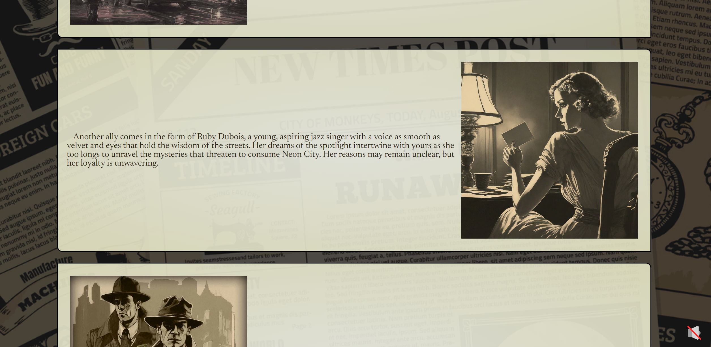
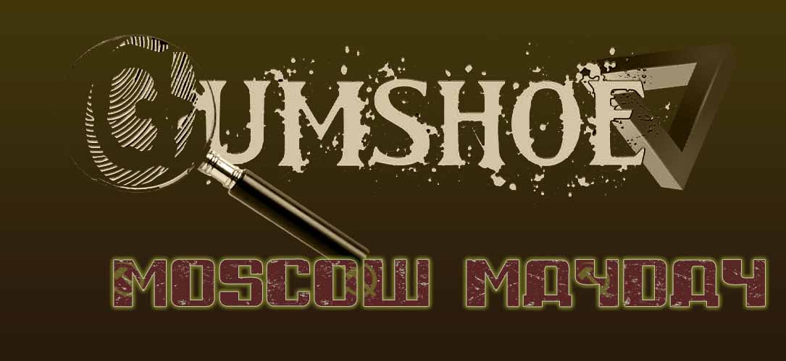

# Gumshoe Neon City

## Description

Rain slicked the chrome of my trench coat, the neon glow of Neon City bleeding into the puddles like spilled dreams. This dame, long gone and presumed dead, had resurfaced on a flimsy postcard. Her message, a cryptic plea for help, tugged at the ghost of what we once had.

Neon City. A rocky hideaway where pleasure and peril intertwined like vipers in a heat haze. I wasn't built for sunshine and sand, my skills honed in the shadows of steel canyons. But a dame in distress? That's a case I couldn't walk away from.

Dice would roll, fists might fly, and the secrets whispered by this city would unravel faster than a floozy's alibi. With spooks, shills, and dames with more secrets than a locked vault, I was about to dive down a rabbit hole deeper than a bootlegger's cellar. This wasn't just about a dame; it was about unraveling a conspiracy bigger than all of us. And in this neon-drenched concrete jungle, the only way out was through.

---

## Table of Contents

1. [Screenshots](#screenshots)
1. [Links](#links)
1. [Gameplay](#gameplay)
1. [Roadmap](#roadmap)
1. [License](#license)
1. [Credits](#credits)
1. [Contact](#contact)

---

## Screenshots

Click here for more!

 

#### Main Page

#### Player Page

#### Story Teller Page

---

## Links

[Deployed](https://8bitginger.github.io/gumshoe/)

[Repo](https://github.com/8BitGinger/gumshoe)

---

## Gameplay

 Players 

 

[Player Info](https://8bitginger.github.io/gumshoe/pages/players.html)

Story Tellers

 

[Story Teller Info](https://8bitginger.github.io/gumshoe/pages/storyteller.html)

---

## Roadmap

#### Adventures

Will be adding more than just the starter adventure during future development.

Future Adventures:

 

-Gumshoe Neon City Chapters 2 and 3

> Find out the fate of You and your unlikely group of allies on the mean streets of Neon City!

- Gumshoe Hollywoodland

  

  > The smog hung heavy over Tinseltown, a sickly yellow halo above the hazy dreamscape. Here, ambition dripped like sweat under the merciless California sun, where fortunes were made and shattered faster than a celluloid kiss. Dames with million-dollar smiles hawked their wares, and chisel-jawed fellas with steely gazes dreamt of the silver screen. But beneath the glitz, a darkness festered. Whispers slithered through back alleys, tales of things unnatural, of creatures from beyond the frame. Hollywoodland, they called it. More like Hollyweirdland, a place where the scripts got stranger than anything dreamed up by a drunken screenwriter. You, chum, are the only shamus with the guts (and the bottle) to wade through this celluloid nightmare.

- Gumshoe Revenge in Rio

  

  > The Amazon humidity hung heavy in Rio, a suffocating cloak over the vibrant chaos. Christ the Redeemer, its skeletal form reaching towards the hazy sky, offered no solace. Here, in 1936 Rio, the samba pulsed with a darker rhythm. I, a weary gumshoe used to the grit of New York City, had arrived for some sun-drenched R&R. But past sins are like stray bullets, they have a way of finding you, even in paradise. A face from a forgotten case materialized across the casino floor – Frankie "The Fox" Moretti, a hood I put away back in '32. He shouldn't be here, breathing, radiating barely contained rage. Looks like my Rio vacation just took a sharp turn into a labyrinth of showgirls with deadly secrets, a murder threatening to ignite a war, and Frankie "The Fox" Moretti thirsting for revenge as cold as a Rio night. This dame in distress wouldn't be wearing a swimsuit, but a shroud.

- Gumshoe Moscow Mayday

  

  > Moscow, a frozen tomb bathed in perpetual twilight. Not a great place for your plane to go down. Surviving the crash was the easy part, the saga ahead, well you might no be as lucky. You, a gumshoe with a nose for trouble and a taste for cheap vodka, were partnered with Nika Arovka, a Soviet ambassador with a smile too sharp and eyes like glacial ice. Whispers of strange men in uniforms and ancient alien devices with world-ending power sent you both hurtling through this frozen hell. A down-on-your-luck detective, and a femme fatale with buried secrets, were all that stood between oblivion and a world cracked open like a rotten egg.

- Gumshoe Agents of the Multiverse

  

  > The last case went sideways faster than a greased getaway car. Now, you find yourself yanked from the familiar grime and grit and deposited in... well, who even knows? The Penrose Division, that's what they call themselves. Seems this rabbit hole runs deeper than a bootleg speakeasy. Multiverse travel, alternate realities, alien threats, the whole kit and kaboodle. All under the steely gaze of your new boss, April Sunday. A dame with a name that wouldn't be out of place in a bygone era, stuck in a world that makes yesterday's case look like a walk in the park. One thing's for sure, shamus: the gloves are off. Crack the case with the help of your new partner Nika Arovak, stop whatever's bleeding through the seams of reality, and maybe, just maybe, impress Ms. Sunday enough to learn the mystery that started this whole adventure!

  

#### _Database_

Would like to add a database connection where we could do the following:

- User Accounts/Login

- Saved Characters

- Items and Equipment

#### _Character Builder_

- More drop downs and static options where the calculations for your character and stats are done automatically.

- Character Sheet to PDF after creation

- Save character to your account after Database is connected

#### _Random Generator_

Would like to build a random generator where Story Tellers can come and generate the following:

- Random NPCs and Characteristics
- Random Items
- Random Buildings/Locales
- Random Encounters
- Random Names

#### _Player Forum_

A form where users can make posts about the game and interact with stories, ideas, concepts, or theories about the games future Adventures

---

## License

[GPLv3](https://www.gnu.org/licenses/gpl-3.0)

---

## Credits

#### Graphics and Music:

I generated the artwork and the music track from:
[AI Test Kitchen](https://aitestkitchen.withgoogle.com/)

_except_ for the Characters and Buildings in the Story Teller Page where I switched it up and used:
[OpenArt](https://openart.ai/)

It was actually quite easy and fun once I got a handle on some of the prompts. I was quite impressed with the results. _Of course it required many hours of photoshop to correct, edit, shade, and sepia-tone each image, but totally worth it!_

Gumshoe Neon City logos and matching Page Logos were designed by me with assets from [pngTree](https://pngtree.com/)

Intro screen re-mixed on: [Spline](https://spline.design/)

---

## Contact

[Gmail](mailto:ryan.fann@gmail.com)

#### GitHub:

[8BitGinger](https://github.com/8BitGinger)

---

