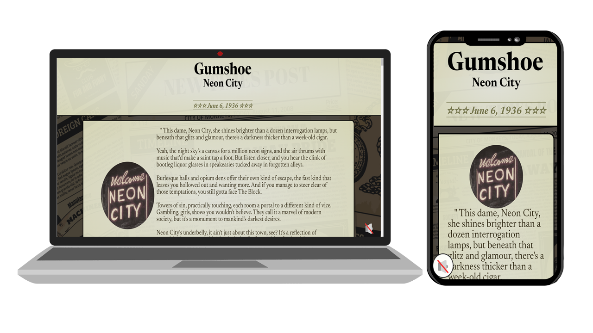

# Gumshoe Neon City

## Description

Rain slicked the chrome of my trench coat, the neon glow of Neon City bleeding into the puddles like spilled dreams. This dame, long gone and presumed dead, had resurfaced on a flimsy postcard. Her message, a cryptic plea for help, tugged at the ghost of what we once had.

Neon City. A desert mirage where pleasure and peril intertwined like vipers in a heat haze. I wasn't built for sunshine and sand, my skills honed in the shadows of steel canyons. But a dame in distress? That's a case I couldn't walk away from.

Dice would roll, fists might fly, and the secrets whispered by this city would unravel faster than a floozy's alibi. With spooks, shills, and dames with more secrets than a locked vault, I was about to dive down a rabbit hole deeper than a bootlegger's cellar. This wasn't just about a dame; it was about unraveling a conspiracy bigger than all of us. And in this neon-drenched jungle, the only way out was through.

---

## Table of Contents

1. [Screenshots](#screenshots)
1. [Links](#links)
1. [Gameplay](#gameplay)
1. [Contact](#contact)

---

## Screenshots

Click here for more!

 

---

## Links

[Deployed](https://8bitginger.github.io/gumshoe/)

[Repo](https://github.com/8BitGinger/gumshoe)

---

## Gameplay

---

## Contact

[Gmail](mailto:ryan.fann@gmail.com)

#### GitHub:

[8BitGinger](https://github.com/8BitGinger)
